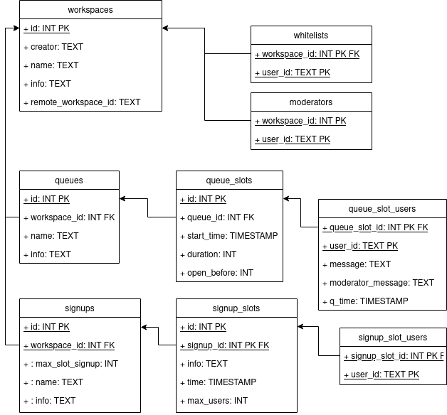

# Tosca

* [Icons](https://github.com/tabler/tabler-icons)

## Schema

## Foreign-API

* ValidateToken(Token) -> UserID
* DestroyToken(Token) -> bool
* GetUser(Token, UserID) -> UserData
* GetGroupUsers(Token, GroupID) -> [UserID]

### UserData (JSON)
* UserID: String
* Name: String
* Permissions: Integer (0 - normal, 1 - admin, 2 - super)
